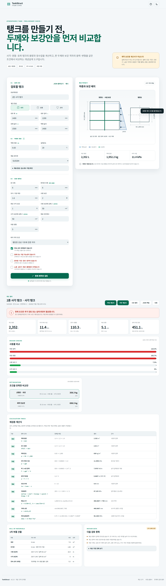

# TankStruct

상압 액체 저장탱크의 용량, 정수압, 판 응력·변형과 보강 격자를 비교하고 재검증 계산서를 저장하는 브라우저 기반 1차 구조검토 도구입니다.

- 공개 웹서비스: <https://ko9ma7.github.io/tankstruct/>
- GitHub 저장소: <https://github.com/ko9ma7/tankstruct>



## 핵심 기능

- 사각·원통·호퍼 형상과 실제 액체 높이 기반 용량 계산
- 액체 비중을 반영한 바닥 최대 정수압과 벽 합력
- 사각 패널 1방향 스트립 근사 응력·변형
- 원통 얇은막 둘레응력
- 수평·수직 보강재 요구 단면계수와 실제 프로파일 Z 비교
- 균형안·제작 단순안·판재 경량안 비교
- 1차 BOM과 판재 추정 중량
- 공식·입력값 대입·결과·단위·근거를 한 표로 제공
- 전체 계산 추적과 경고가 포함된 PNG·다중 페이지 PDF 계산서
- 재료 물성 직접 수정, 로컬 자동저장, JSON 백업·복원, CSV 결과, 인쇄
- 정면도·평면도 기반 2D 공학 도식과 수압·보강 위치 표시
- 모바일·다크 모드·키보드 접근성

## 중요한 범위

이 도구는 실제 FEA나 제작 승인 계산서가 아닙니다. 상압·개방형 탱크의 개념설계와 견적 비교에만 사용합니다. 밀폐·가압·진공, 지진, 운반, 교반기·노즐, 지지대, 용접 상세, 좌굴, PP 장기 크리프는 전문 검토가 필요합니다.

## 실행

```powershell
python -m http.server 4174
```

`http://localhost:4174`를 엽니다.

## 테스트

```powershell
npm ci
npm run validate
```

`validate`는 GitHub Pages 정적 번들 생성, 단위·정적 테스트와 Playwright 브라우저 시나리오를 순서대로 실행합니다.

## 프로젝트 구조

```text
tank-structure-screening/
├─ index.html
├─ css/styles.css
├─ data/materials.json
├─ js/
│  ├─ analysis.js
│  ├─ app.js
│  ├─ audit.js
│  ├─ export.js
│  ├─ geometry.js
│  ├─ optimizer.js
│  ├─ report.js
│  └─ storage.js
├─ docs/
│  ├─ CALCULATION_BASIS.md
│  ├─ LIMITATIONS.md
│  ├─ USER_GUIDE.md
│  ├─ calculation-basis.html
│  ├─ limitations.html
│  └─ user-guide.html
├─ vendor/jspdf.umd.min.js
├─ scripts/build.cjs
├─ tests/
└─ assets/screenshots/
```

## 데이터 저장

작업은 현재 브라우저의 `localStorage`에 저장됩니다. 서버 전송, 로그인, 쿠키, 사용자 추적은 없습니다. 다른 PC로 옮길 때는 JSON 백업을 사용합니다.

## 배포

- 공개 소스는 `main`, 빌드 결과는 `gh-pages` 브랜치에 둡니다.
- GitHub Pages는 `gh-pages` 브랜치 루트를 직접 배포합니다.
- 상대경로와 `.nojekyll`을 사용하므로 `/tankstruct/` 하위 경로에서 새로고침해도 자산이 유지됩니다.

## 문서

- [디자인된 계산 근거](docs/calculation-basis.html)
- [디자인된 사용 설명서](docs/user-guide.html)
- [디자인된 한계와 전문 검토 전환 기준](docs/limitations.html)
- 원문 자료: [계산 근거 Markdown](docs/CALCULATION_BASIS.md), [사용 설명 Markdown](docs/USER_GUIDE.md), [한계 Markdown](docs/LIMITATIONS.md)

## 버전

- v0.2.0: 2D 정투상 도식, 실제 보강재 Z 검증, 전체 계산 추적, PNG/PDF 계산서, 디자인 문서
- v0.1.0: 상압 사각·원통·호퍼 MVP, 비교 최적화, 로컬 저장과 내보내기

## 라이선스

MIT License. 첨부 참고문서와 외부 규격의 저작권은 각 권리자에게 있으며 저장소에 재배포하지 않습니다. PDF 생성에는 별도 라이선스 파일과 함께 vendoring한 jsPDF 4.2.1을 사용합니다.
